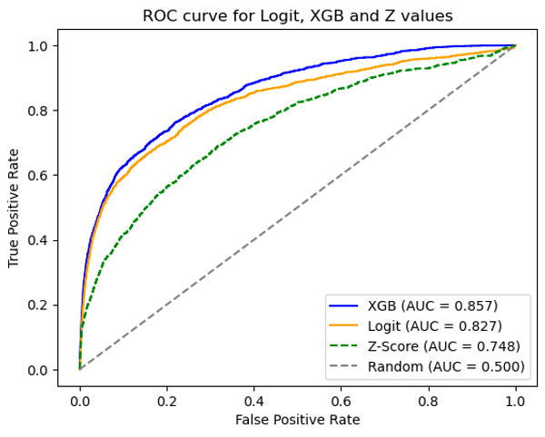

# Portfolio Default Rate Analysis

This project delves into the intricacies of bank data from Italy to ascertain the portfolio default rate, offering enhanced predictions for the one-year probability of default (PD) among prospective borrowers.

## How to Run

### Local Application
Clone this repository and execute `app.py` to run the model as a local application.

### Python Environment
For predictions regarding the probability of default, run `harness.py` in your Python environment.

## Code Overview

The `val.ipynb` Jupyter notebook comprehensively covers data cleansing, Exploratory Data Analysis (EDA), and the model training process. Additionally, the XGBoost model checkpoint is provided as `turquoise_model.bin`.

## Pitch Deck

As a segment of the Applied ML in Finance course at CDS NYU and NYU Stern, this project is encapsulated in `Turquoise_PitchDeck.pdf`, which details every phase of the project.

## Methodological Approach

Our methodology encompasses a series of critical steps:

- Employing various financial ratios for data cleansing and imputation, elaborated in the accompanying write-up.
- Setting the fiscal year from July to June to preemptively address any future-peeking concerns.
- Conducting thorough sanity checks to rectify any data anomalies arising from accounting discrepancies.
- Segmenting key financial ratios into categories: liquidity, profitability, debt coverage, and asset management for in-depth analysis.
- Utilizing Variance Inflation Factor (ViF) and Correlation analysis for both univariate and multivariate examinations to mitigate multicollinearity among independent variables.
- Crafting both a logit model and an XGB model, refined through walk-forward analysis.
- Implementing transcendental transformations on the independent feature set to align the logit model more closely with the robust XGB model, enhancing explainability.
- Benchmarking the outcomes against the Altman Z-Score for a comprehensive evaluation.

## Results

Our findings are encapsulated in the visual below and the subsequent table:

| Model   | AUC Score |
|---------|-----------|
| Logit   | 0.827     |
| XGBoost | 0.857     |
| Z-Score | 0.748     |

Additional insights include:

- Calibration adjustments to align with real-world probability metrics.
- Emphasis on model explainability, leveraging statistical models for Logit and assessing weight, gain, and cover importance in the XGB model.
- Counterfactual analysis to understand the "what-if" scenarios and perform sensitivity analysis on the independent features.
